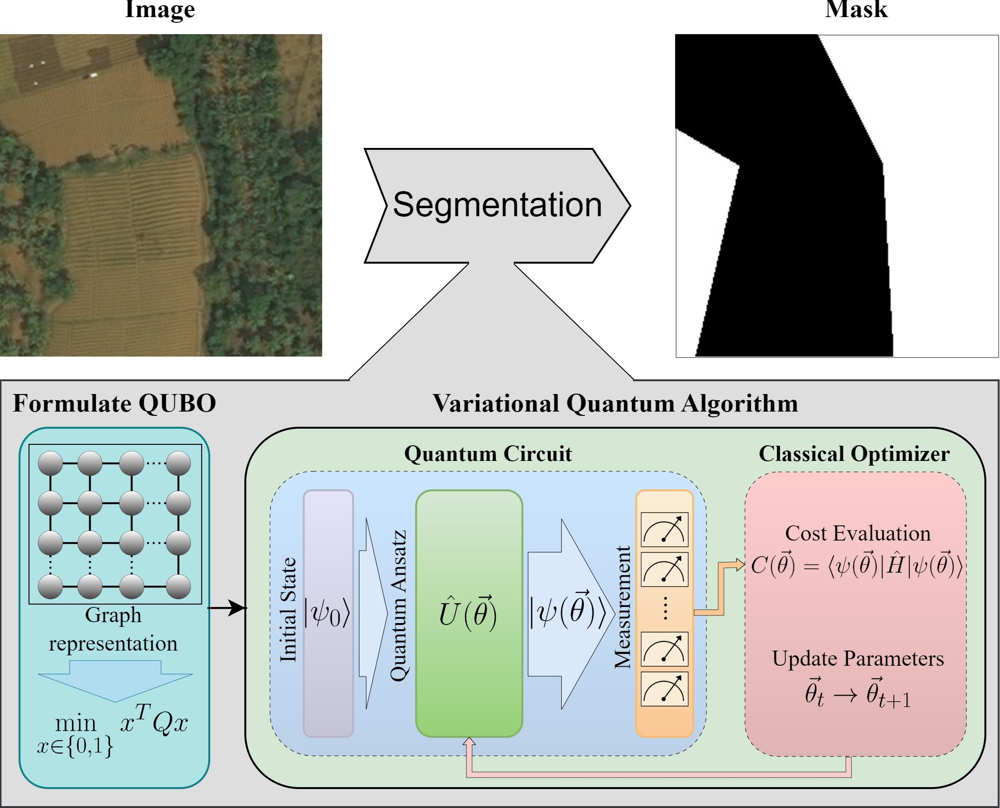
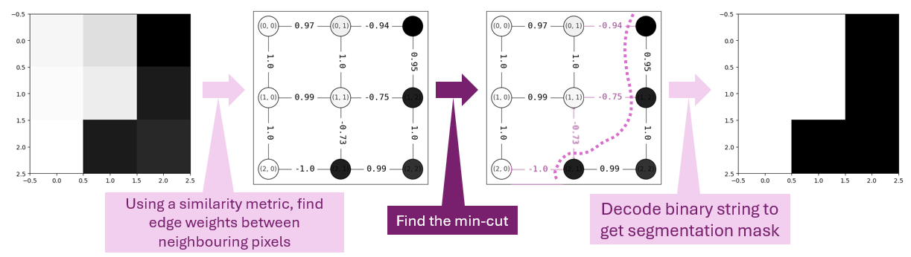
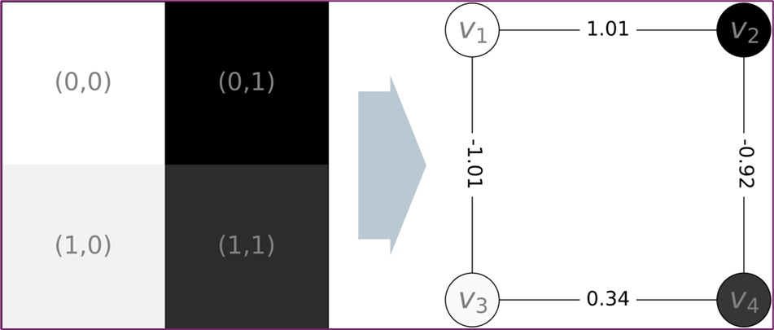
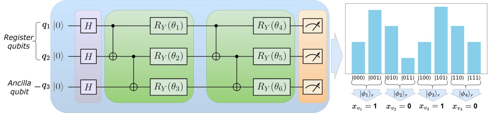

# **NISQ-Seg: Qubit-efficient Variational Quantum Algorithms for Image Segmentation**

[](https://doi.org/10.48550/arXiv.2405.14405)  
[](https://qce.quantum.ieee.org/2024/)  
[](https://www.gnu.org/licenses/old-licenses/lgpl-2.1.html)  
[](https://www.linkedin.com/in/supreethmv/)  
[](https://www.supreethmv.com)

<div align="center">
  
</div>

---

## **Overview**

Welcome to **NISQ-Seg**, the official repository for the paper **"Qubit-efficient Variational Quantum Algorithms for Image Segmentation"**, accepted at the Quantum Computing and Engineering 2024 (QCE'24) conference by IEEE. This repository provides the full pipeline for reproducing the experimental results and demonstrations of the three primary encoding methods introduced in the paper:

<div align="center">
  
</div>


1. **Parametric Gate Encoding (PGE)**
2. **Ancilla Basis Encoding (ABE)**
3. **Adaptive Cost Encoding (ACE)**


These quantum techniques are optimized for **Noisy Intermediate-Scale Quantum (NISQ)** devices and demonstrate efficient qubit usage for **graph-based image segmentation** tasks.

### **Paper Preprint**
The preprint is available on [arXiv](https://doi.org/10.48550/arXiv.2405.14405).

---

## **Repository Structure**

```bash
NISQ-Seg/
│
├── notebooks/
│   ├── abe_experiment.ipynb          # ABE experiments and results
│   ├── ace_experiment.ipynb          # ACE experiments and results
│   ├── pge_experiment.ipynb          # PGE experiments and results
│   ├── paper_figures.ipynb           # For generating paper figures
│   ├── read_results.ipynb            # Parsing and analyzing results
│
├── src/
│   ├── __init__.py                   # Init file for encodings and utilities
│   ├── abe.py                        # Ancilla Basis Encoding implementation
│   ├── ace.py                        # Adaptive Cost Encoding implementation
│   ├── graph_utils.py                # Utility functions for graph generation
│   ├── pge.py                        # Parametric Gate Encoding implementation
│
├── plots/                            # All generated experiment plots
│
├── results/                          # Folder to store experimental results
│
├── _repo_data/                       # Data folder for README images
│   ├── author_image.jpg              # Author image
│   ├── VQA_segmentation_overview.jpg # Overview of segmentation technique
│   └── AdaptiveCostEncoding.jpg      # ACE visualization
│
├── README.md                         # Project documentation (you're reading this!)
├── requirements.txt                  # Python dependencies
└── LICENSE                           # License (GNU LGPL2.1)
└── tutorial.ipynb                # Full pipeline tutorial for 2x2 image
```

---

## **Getting Started**

### **1. Clone the Repository**

```bash
git clone https://github.com/your-repo/NISQ-Seg.git
cd NISQ-Seg
```

### **2. Install Dependencies**

All required Python libraries are listed in the `requirements.txt` file. Install them using the following command:

```bash
pip install -r requirements.txt
```

The dependencies include essential quantum libraries (like Qiskit), optimization libraries (like SciPy), and plotting tools (like Matplotlib).

### **3. Run the Jupyter Notebooks**

Explore the different encoding methods by running the provided Jupyter notebooks:

- `tutorial.ipynb`: A walkthrough of the image segmentation pipeline for a 2x2 image.

<div align="center">
  
</div>

---


- `pge_experiment.ipynb`: Experiments with **Parametric Gate Encoding (PGE)**.
- `abe_experiment.ipynb`: Experiments with **Ancilla Basis Encoding (ABE)**.
- `ace_experiment.ipynb`: Experiments with **Adaptive Cost Encoding (ACE)**.

<div align="center">
  
</div>

---

## **Citing this Work**

If you find this code useful in your research, please cite the following paper:

```bibtex
@article{venkatesh2024qubit,
  title={Qubit-efficient Variational Quantum Algorithms for Image Segmentation},
  author={Venkatesh, Supreeth Mysore and Macaluso, Antonio and Nuske, Marlon and Klusch, Matthias and Dengel, Andreas},
  journal={arXiv preprint arXiv:2405.14405},
  year={2024}
}
```

---

## **Contact**

**Supreeth Mysore Venkatesh**  

For any inquiries, please reach out to:

- Email: supreeth.mysore@dfki.de  
- LinkedIn: [Supreeth Mysore Venkatesh](https://www.linkedin.com/in/supreethmv/)  
- Website: [www.supreethmv.com](https://www.supreethmv.com)


## Contributors

[](https://www.supreethmv.com)